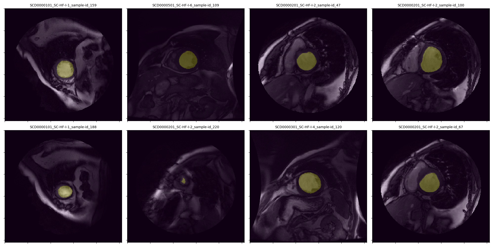

# Medical Image Segmentation Analysis Production Pipeline
---

## Install

	$ git clone repo-url
	$ cd repo-dir/dicom_data_preprocess
	$ chmod +x get_started.sh
	$ ./get_started.sh

## Run

Run the following bash command from the directory *repo-dir/dicom_data_preprocess* to generate the (not shuffled/not partitioned) single batchset of dicom images, masks, metadata, as well as shuffled and partitioned batchset of minibatches of <code>mini_batch_size</code> in *repo-dir/dicom_data_preprocess/data/output_data/* and its corresponding validation plots in *repo-dir/dicom_data_preprocess/plots/*

	$ python preprocessor.py

# Part 1: Parse the DICOM images and Contour Files
---
The <code>reader</code> module in the *dicom data preprocessing* block of the pipeline is responsible
for taking the raw DICOM and contour files, assembling the correct DICOM image with the correct 
contour file (if any) given link.csv, and then extracting (parsing) the DICOM image, boolean mask of the contours, and metadata into a single batchset. metadata, here by the way, means patient_id-original_id-sample_id where patient_id and original_id were taken from the link.csv and sample_id is the correspondance between the dicom file and contour file given contour type. <code>save_plot</code> parameter of the <code>reader</code> (if enabled) generates the subplots of all assembled sample pairs of DICOM image and mask for visual validation. 

Starter code provided in <code>parsing.py</code> is imported into <code>reader</code> module. Although methods in <code>parsing.py</code> are sufficient, <code>parse_dicom_file</code> and <code>parse_contour_file</code> methods were updated to return the parsed DICOM image as an image array (rather than a dictionary with parsed DICOM image data) and to check whether the contour file contains at least three coordinates to form the simplest polygon, respectively, before integrating into the production codebase.

Unit tests were created and executed to test the <code>parse_contour_file</code>, <code>parse_dicom_file</code>, <code>poly_to_mask</code> methods in the <code>parsing</code> module, as well as the public methods in the <code>reader</code> module. Test scripts are located in *repo-dir/tests*, while the plot to validate the generated output (parsed dicom images and its corresponding masks and metadata) from the <code>DataReader.load_samples</code> method is located in *repo-dir/tests/plots*.

# Part 2: Model training pipeline
---
After the <code>reader</code> module creates the single batchset of dicom images, masks, and metadata, the <code>loader</code> module in the *dicom data preprocessing* block of the pipeline then takes the (not shuffled/not partitioned) single batchset of dicom images, masks, and metadata, shuffles the samples, and then partitions the single batchset into x number of mini batches of <code>mini_batch_size</code>.

No updates were made to the <code>reader</code> module in order for the <code>loader</code> module to shuffle and partition the single batchset into a list of minibatches with <code>mini_batch_size</code>. However for the future, if we were to accomodate evaluation of both types of contours (i-contours, o-contours) or perhaps n number of contour types at the same time, the <code>reader</code> module or the <code>preprocessor.py</code> wrapper will have to be tweaked.

Unit tests were created and executed to test the <code>random_mini_batches</code> method in the <code>loader</code> module. To evaluate the integration of the <code>reader</code> and <code>loader</code> modules, I designed the *Dicom Data Preprocessing* block of the pipeline to cache the output of the following (in case for further debugging/validation)
<ol>
<li> (Not shuffled/not partitioned) single batchset of dicom images, masks, metadata from <code>reader</code> module</li>
<li> Shuffled and partitioned batchset of minibatches of <code>mini_batch_size</code> from <code>loader</code> module</li>
</ol>

In addition, the <code>plot_samples</code> method from the <code>reader</code> module is modular where plots can be generated to verify the shuffled and partitioned dataset generated by the <code>DataLoader</code> against the not shuffled dataset from the <code>DataReader</code> (*repo-dir/dicom_data_preprocess/plots/*).

FIGURE: Image above is one of the minibatches (mini_batch_size = 8) generated by <code>DataLoader.random_mini_batches</code> given <code>contour_type</code> = 'i-contours'

